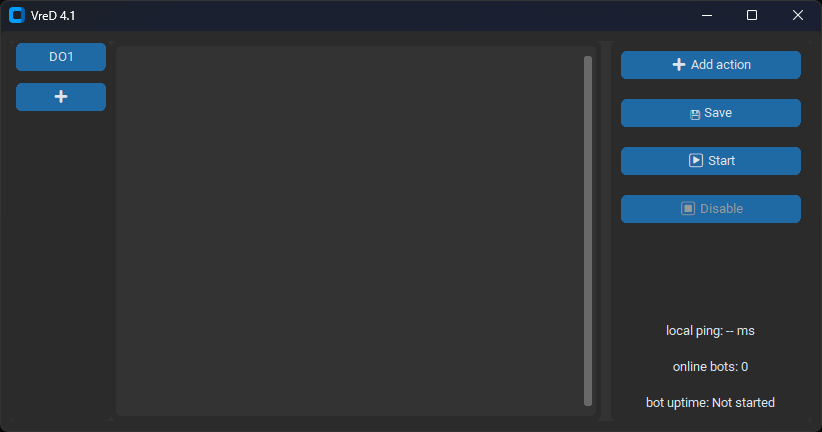

# VreD 4.1
 
 
---

## Features

Easy to control & Create bots with telegram api & token
Accesible multitoken

## Usage

1. **Clone the repo**:

```bash
git clone https://github.com/Batcherss/telegram-bot-constructor.git
cd telegram-bot-constructor
```

2. **Run the tool**:
download the library
```bash
pip install telebot requests
```
start the main.py and enter telegram bot token & or more

4. **Set it up:**
Set up actions setting and DO numbers

---

## Requirements

* Python ~3.13
* Internet access
* telebot and request library
---

## License
MIT — use it wisely.
